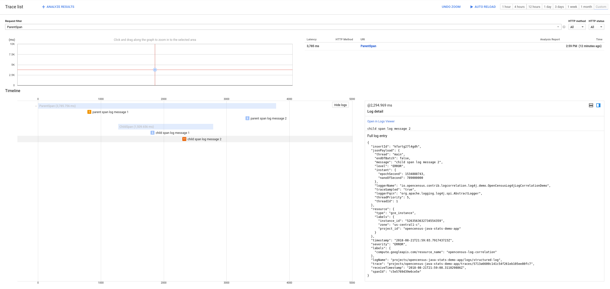
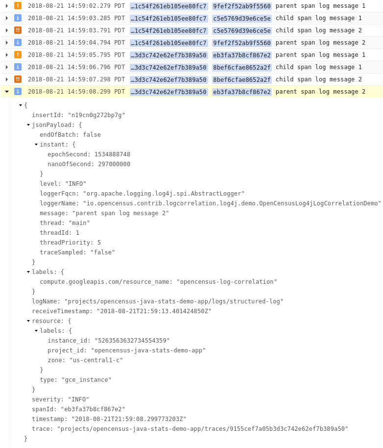

# OpenCensus Log4j 2 Log Correlation Demo

This directory contains an application with Log4j log statements and OpenCensus tracing
instrumentation that can be configured to work with Stackdriver's log correlation features.  This
readme describes how to configure the Stackdriver Logging agent to export the application's log in a
format that allows Stackdriver to match the log entries with traces.

## Design of the project

The application contains Log4j log statements.  It uses
[`opencensus-contrib-log-correlation-log4j`](https://github.com/census-instrumentation/opencensus-java/tree/master/contrib/log_correlation/log4j)
to insert the current trace ID, span ID, and sampling decision into every Log4j `LogEvent`.  The
project enables `opencensus-contrib-log-correlation-log4j` by adding it as a runtime dependency and
specifying its `ContextDataInjector` override with a system property, i.e.,
`-Dlog4j2.contextDataInjector=io.opencensus.contrib.logcorrelation.log4j.OpenCensusTraceContextDataInjector`.

The project configures Log4j with XML, in `log4j2.xml`.  The logging configuration uses a
`JsonLayout` to output structured logs.  Structured logs simplify specifying the tracing fields to
be set in the `LogEntry` data structure that the agent exports to Stackdriver.

## Instructions for setting up Stackdriver log correlation

### Prerequisites

1. A Google Cloud project with Stackdriver Logging enabled.
2. A VM for running the application and the Stackdriver Logging agent.  Note that its logs may be
uploaded to Stackdriver.

### Setting up log correlation

1. Install the Stackdriver Logging agent on the VM.  Enable structured logging during the
installation process, as described in
https://cloud.google.com/logging/docs/structured-logging#structured-log-install.

2. Set the environment variable `GOOGLE_CLOUD_PROJECT` to the Google Cloud project's project ID.

  TODO(sebright): Find a way to look up the project ID automatically.

3. Add a fluentd configuration file for reading the JSON log file produced by the application, as
described in https://cloud.google.com/logging/docs/agent/configuration#structured-records.  Ensure
that `log4j2.xml` and the fluentd configuration specify the same log file.

4. Add the following fluentd filter to transform Log4j's `level` field into the `severity` field
that is expected by Stackdriver.  Ensure that the tag on the first line matches the tag in the
fluentd configuration file from step 3.

  ```xml
  <filter structured-log>
    @type record_transformer
    <record>
      severity ${record["level"]}
    </record>
  </filter>
  ```

5. Restart the Stackdriver Logging agent so that it picks up the configuration changes:

  ```
  sudo service google-fluentd restart
  ```

6. Run the application:

  ```
  ./gradlew :opencensus-contrib-log-correlation-log4j-demo:run
  ```

7. Look for the logs and traces in Stackdriver.

### Screenshots from running the demo

Sampled trace in Stackdriver, with log entries displayed below each span:



Log entries containing "trace", "spanId", and "traceSampled" fields in Stackdriver.  All Log4j log
entry fields that are not recognized by Stackdriver appear under "jsonPayload":


