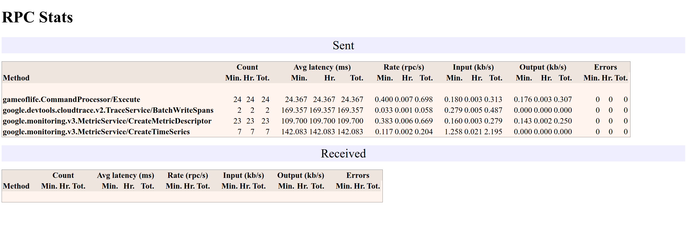
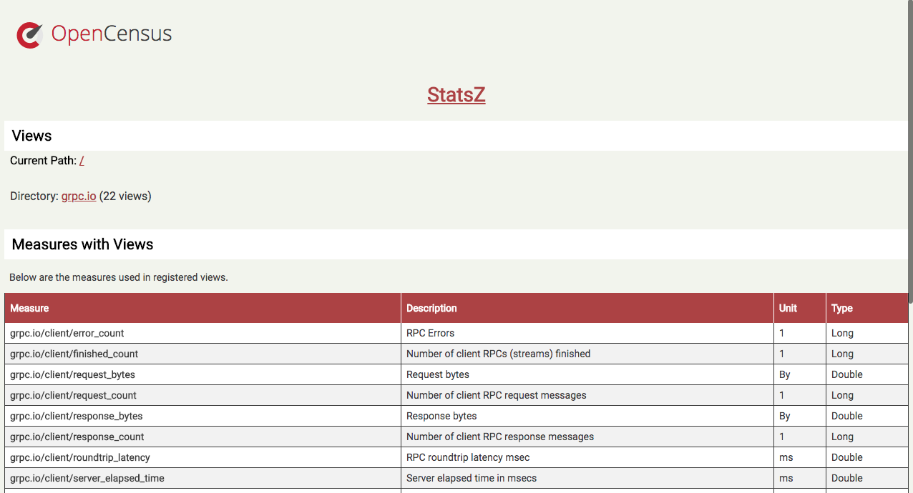
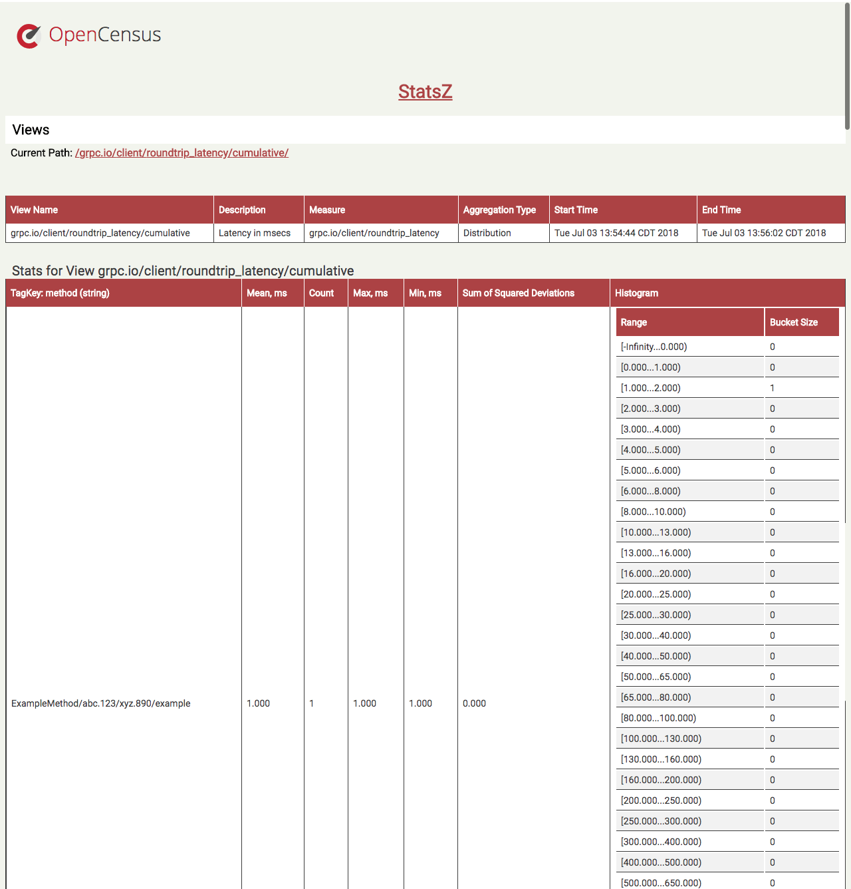
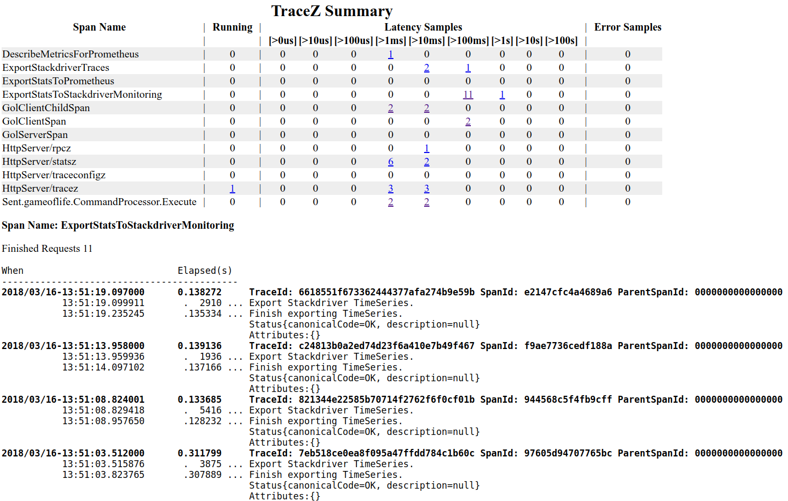
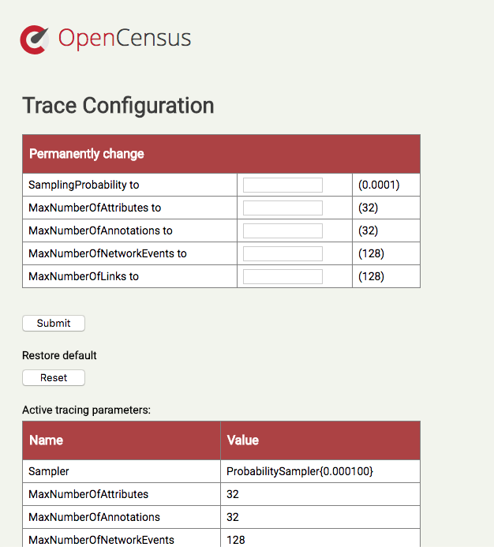

# OpenCensus Z-Pages
[![Build Status][travis-image]][travis-url]
[![Windows Build Status][appveyor-image]][appveyor-url]
[![Maven Central][maven-image]][maven-url]

The *OpenCensus Z-Pages for Java* is a collection of HTML pages to display stats and trace data and
allows library configuration control.

## Quickstart

### Add the dependencies to your project

For Maven add to your `pom.xml`:
```xml
<dependencies>
  <dependency>
    <groupId>io.opencensus</groupId>
    <artifactId>opencensus-api</artifactId>
    <version>0.19.0</version>
  </dependency>
  <dependency>
    <groupId>io.opencensus</groupId>
    <artifactId>opencensus-contrib-zpages</artifactId>
    <version>0.19.0</version>
  </dependency>
  <dependency>
    <groupId>io.opencensus</groupId>
    <artifactId>opencensus-impl</artifactId>
    <version>0.19.0</version>
    <scope>runtime</scope>
  </dependency>
</dependencies>
```

For Gradle add to your dependencies:
```gradle
compile 'io.opencensus:opencensus-api:0.19.0'
compile 'io.opencensus:opencensus-contrib-zpages:0.19.0'
runtime 'io.opencensus:opencensus-impl:0.19.0'
```

### Register the Z-Pages

```java
public class MyMainClass {
  public static void main(String[] args) throws Exception {
    ZPageHandlers.startHttpServerAndRegisterAll(8080);
    // ... do work
  }
}
```

### View stats and spans on Z-Pages

#### View RPC stats on /rpcz page

The /rpcz page displays the canonical gRPC cumulative and interval stats broken down by RPC methods.
Example:



#### View measures and stats for all exported views on /statsz page

The /statsz page displays measures and stats for all exported views. Views are grouped into directories 
according to their namespace. Example:




#### View trace spans on /tracez page

The /tracez page displays information about all active spans and all sampled spans based on latency 
and errors. Example:



#### View and update tracing configuration on /traceconfigz page

The /traceconfigz page displays information about the current active tracing configuration and 
allows users to change it. Example:




### FAQ

#### Why do I not see sampled spans based on latency and error codes for a given span name?
Sampled spans based on latency and error codes are available only for registered span names. 
For more details see [SampledSpanStore][sampledspanstore-url].

[travis-image]: https://travis-ci.org/census-instrumentation/opencensus-java.svg?branch=master
[travis-url]: https://travis-ci.org/census-instrumentation/opencensus-java
[appveyor-image]: https://ci.appveyor.com/api/projects/status/hxthmpkxar4jq4be/branch/master?svg=true
[appveyor-url]: https://ci.appveyor.com/project/opencensusjavateam/opencensus-java/branch/master
[maven-image]: https://maven-badges.herokuapp.com/maven-central/io.opencensus/opencensus-contrib-zpages/badge.svg
[maven-url]: https://maven-badges.herokuapp.com/maven-central/io.opencensus/opencensus-contrib-zpages
[sampledspanstore-url]: https://github.com/census-instrumentation/opencensus-java/blob/master/api/src/main/java/io/opencensus/trace/export/SampledSpanStore.java
